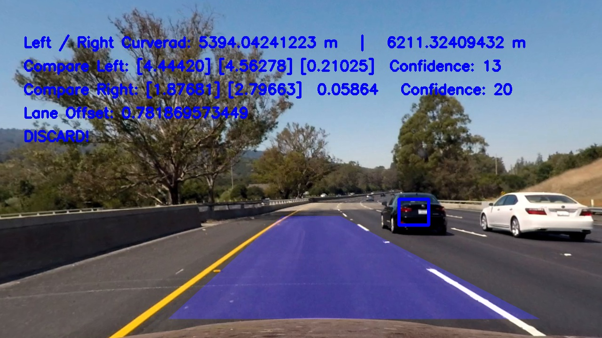
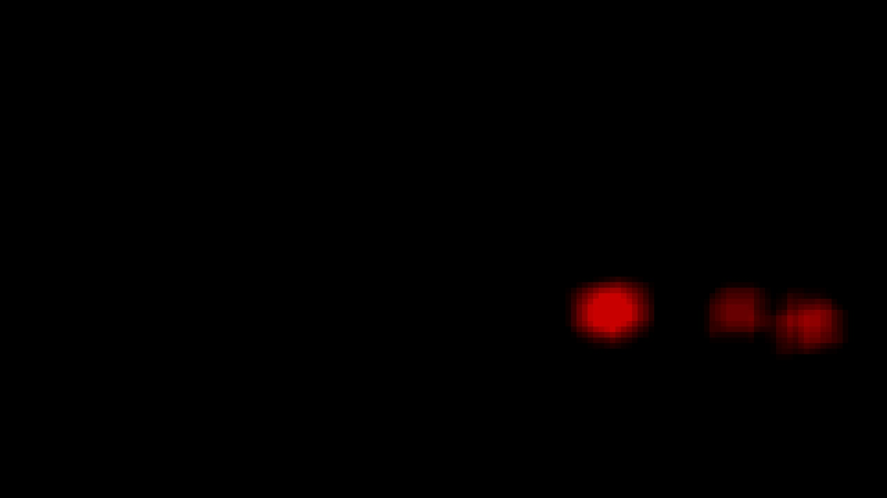
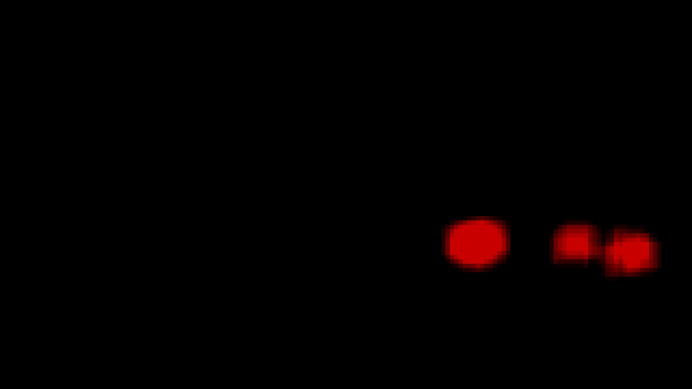
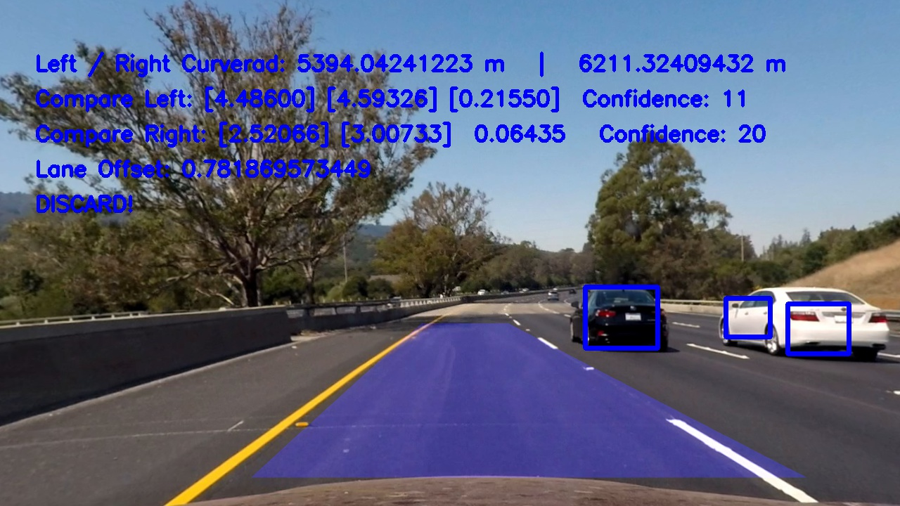
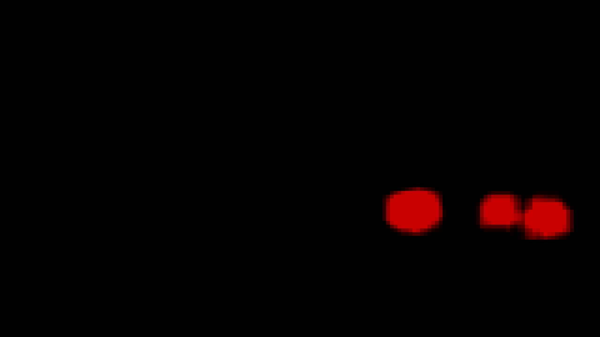
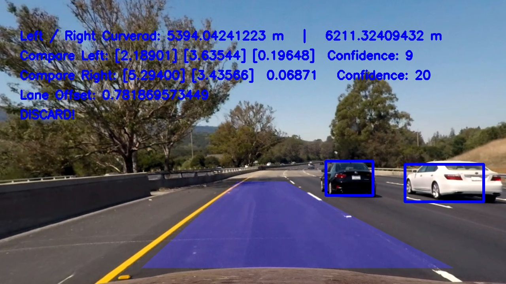
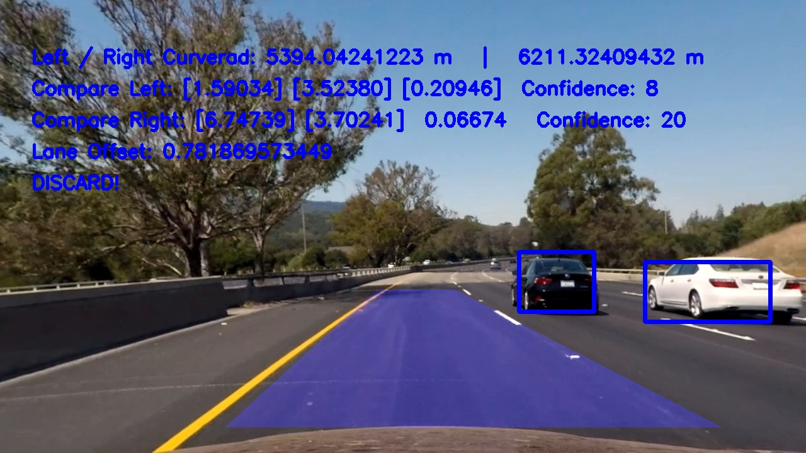
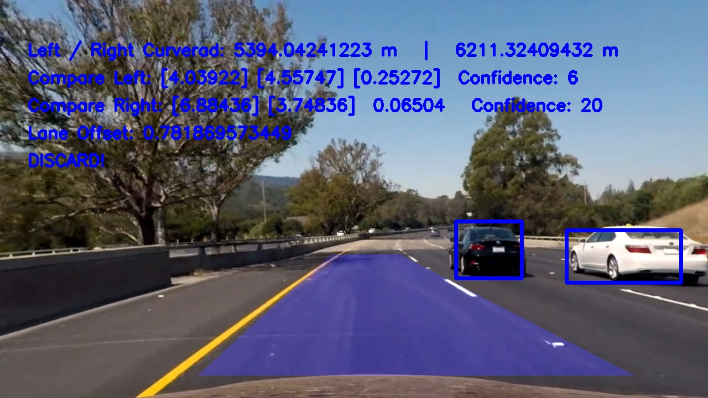
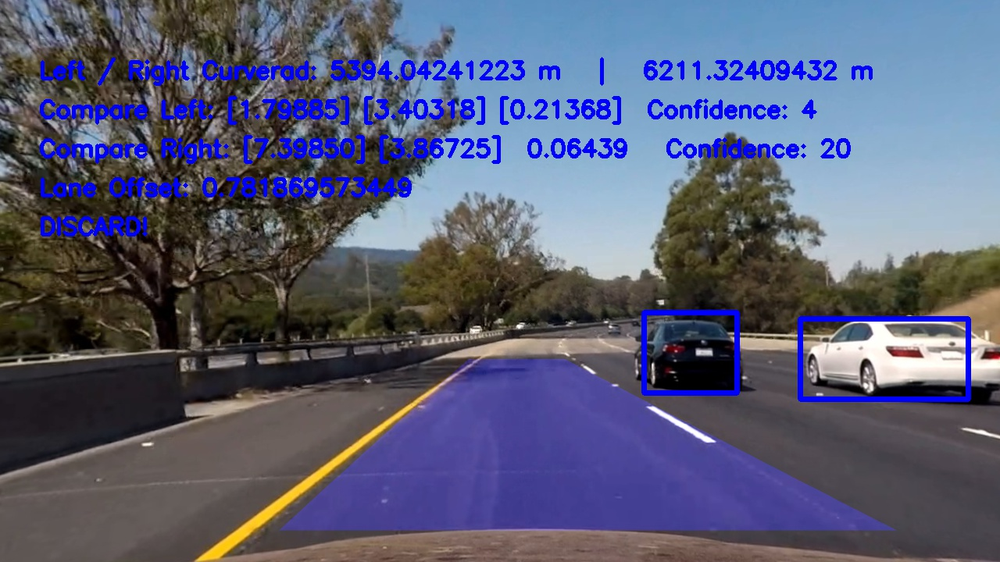

# CarND-Vehicle-Detection-mwolfram

## Writeup
---


**Vehicle Detection Project**

The goals / steps of this project are the following:

* Perform a Histogram of Oriented Gradients (HOG) feature extraction on a labeled training set of images and train a classifier Linear SVM classifier
* Optionally, you can also apply a color transform and append binned color features, as well as histograms of color, to your HOG feature vector.
* Note: for those first two steps don't forget to normalize your features and randomize a selection for training and testing.
* Implement a sliding-window technique and use your trained classifier to search for vehicles in images.
* Run your pipeline on a video stream (start with the test_video.mp4 and later implement on full project_video.mp4) and create a heat map of recurring detections frame by frame to reject outliers and follow detected vehicles.
* Estimate a bounding box for vehicles detected.

[//]: # (Image References)
[car_sample]: ./output_images/car.png
[notcar_sample]: ./output_images/notcar.png
[car_HLS_hog]: ./output_images/car_HLS_hog.png
[car_YCrCb_hog]: ./output_images/car_YCrCb_hog.png
[notcar_HLS_hog]: ./output_images/notcar_HLS_hog.png
[notcar_YCrCb_hog]: ./output_images/notcar_YCrCb_hog.png

[sliding_window]: ./output_images/sliding_window.png
[find_cars_scale_1.5]: ./output_images/test1scale1.5.jpg
[find_cars_scale_1.0]: ./output_images/test1scale1.0.jpg

[video_final]: ./project_video_final_out.mp4
[video_debug]: ./project_video_debug_out.mp4

## [Rubric](https://review.udacity.com/#!/rubrics/513/view) Points
### Here I will consider the rubric points individually and describe how I addressed each point in my implementation.  

---
### Writeup / README

#### 1. Provide a Writeup / README that includes all the rubric points and how you addressed each one.  You can submit your writeup as markdown or pdf.  [Here](https://github.com/udacity/CarND-Vehicle-Detection/blob/master/writeup_template.md) is a template writeup for this project you can use as a guide and a starting point.  

You're reading it!

### Previous Assignment

The code from [Project 4 (Advanced Lane Lines)](https://github.com/mwolfram/CarND-Advanced-Lane-Lines-mwolfram) was reused in this project. The camera calibration step is described there. The lane line detection pipelines were reused for the videos, and the bounding boxes that resulted from vehicle detection were overlaid on these images.

### Configuration and RuntimeData

I used singletons for my Configuration and RuntimeData. The former holds configuration that I'd like to set globally and use it everywhere in the notebook and the latter stores data that has to be stored between images (for example if they come as frames from a video), so in our case the heatmap. I also used this construct for caching parts of the calculation between individual runs (for example optimizing the heatmap parameters without having to rerun hog feature extraction and sliding window)

### Histogram of Oriented Gradients (HOG)

#### 1. Explain how (and identify where in your code) you extracted HOG features from the training images.

The code for this step is contained in the ```single_img_features``` function (this in turn is called by by ```extract_features``` to extract features from multiple images). By activating ```hog_feat```, the function will extract hog features from the image and return the identified features as a feature vector.

I started by reading in all the `vehicle` and `non-vehicle` images.  Here is an example of one of each of the `vehicle` and `non-vehicle` classes:

![car_sample][car_sample]
*Sample from class "vehicle"*

![notcar_sample][notcar_sample]
*Sample from class "non-vehicle"*


During the course I explored different color spaces and different hog parameters. I came up with "HLS" as color space, (16, 16) for spatial size and 16 histogram bins. I used all hog channels. Later in the project I realized that "YCrCb" yielded better results so that's used for the final video. In the "HLS" color space I had a significantly higher amount of false positives.

Here is an example using the following parameter set:

```python
self.COLOR_SPACE = "YCrCb"
self.SPATIAL_SIZE = (16, 16)
self.HIST_BINS = 16
self.ORIENTATIONS = 9
self.PIX_PER_CELL = 8
self.CELLS_PER_BLOCK = 2
self.HOG_CHANNEL = "ALL"
self.SPATIAL_FEAT = True
self.HIST_FEAT = True
self.HOG_FEAT = True
self.SCALE = 1.5
self.HIST_RANGE = (0, 1)
self.Y_START_STOP = [400, 670]
```

![car_HLS_hog][car_HLS_hog]
*HOG Features of car in HLS color space*

![car_YCrCb_hog][car_YCrCb_hog]
*HOG Features of car in YCrCb color space*

![notcar_HLS_hog][notcar_HLS_hog]
*HOG Features of notcar in HLS color space*

![notcar_YCrCb_hog][notcar_YCrCb_hog]
*HOG Features of notcar in YCrCb color space*

#### 2. Explain how you settled on your final choice of HOG parameters.

It was a short trial and error run during the course that soon yielded good results. I started off with the RGB color space and spatial size and hist bins both set to 32. By changing the color channel to HLS and spatial size and hist bins to 16, I immediately got a better accuracy rating. Later in the project I experimented with other color spaces (tried different settings and tested them on the whole pipeline). YCrCb turned out to significantly reduce the number of false positives. I used all 3 channels for hog extraction all the time.

#### 3. Describe how (and identify where in your code) you trained a classifier using your selected HOG features (and color features if you used them).

I trained a linear SVM using the ```def train_classifier():``` function. It will read in a list of cars and notcars and extract features from these images. I always used a combination of spatial features, histogram features and hog features. The feature vector is then normalized, split into training and test sets and passed to the SVM.

### Sliding Window Search

#### 1. Describe how (and identify where in your code) you implemented a sliding window search.  How did you decide what scales to search and how much to overlap windows?

I used ```slide_window``` followed by ```search_windows``` in the beginning, with the default settings from the course and no change in the window size or step size. I soon started using ```find_cars``` instead, which will perform hog subsampling. So it will first extract the hog features for the whole image and then extract the features from windows that slide over the image. Here I set ```cells_per_step``` to 1 to get a more fine-grained detection. Also, I changed the scale setting to 1.0 later in the project. This resulted in a much longer runtime, but also reduced the number of false positives.

#### 2. Show some examples of test images to demonstrate how your pipeline is working.  What did you do to optimize the performance of your classifier?

The following images show samples of the combination of ```slide_window``` and ```search_windows``` (6 test images), and two runs of ```find_cars``` (using HOG subsampling), with scale settings of 1.5 and 1.0. Notice how the false positives are reduced when using scale 1.0.

![sliding_window][sliding_window]
*```slide_window``` followed by ```search_windows```*

![find_cars_scale_1.5][find_cars_scale_1.5]
*Find cars scale 1.5*

![find_cars_scale_1.0][find_cars_scale_1.0]
*Find cars scale 1.0*

---

### Video Implementation

#### 1. Provide a link to your final video output.  Your pipeline should perform reasonably well on the entire project video (somewhat wobbly or unstable bounding boxes are ok as long as you are identifying the vehicles most of the time with minimal false positives.)
Here's a [link to my video result][video_final], and [here][video_debug] you can see a video showing individual steps of the pipeline (from top left to bottom right: unfiltered sliding window detection result, heatmap, labels, final bounding boxes based on labels)

#### 2. Describe how (and identify where in your code) you implemented some kind of filter for false positives and some method for combining overlapping bounding boxes.

I recorded the positions of positive detections in each frame of the video.  From the positive detections I created a heatmap (```add_heat```) and then thresholded that map to identify vehicle positions (```apply_threshold```). I also used a ```cooldown``` to reduce heatmap values over time.  I then used `scipy.ndimage.measurements.label()` to identify individual blobs in the heatmap.  I then assumed each blob corresponded to a vehicle.  I constructed bounding boxes to cover the area of each blob detected.

Here's an example result showing the heatmap from a series of frames of video, the result of `scipy.ndimage.measurements.label()` and the bounding boxes then overlaid on the last frame of video:

### Here are ten frames and their corresponding heatmaps as well as their labels:

Frame with bounding boxes  |  Corresponding heatmap | Labels
:-------------------------:|:-------------------------:|:-------:
  |   | 
  |   | 
  |   | 
  |   | 
  |   | 
  |   | 
  |   | 
  |   | 
  |   | 
  |   | 

---

### Discussion

#### 1. Briefly discuss any problems / issues you faced in your implementation of this project.  Where will your pipeline likely fail?  What could you do to make it more robust?

Here I'll talk about the approach I took, what techniques I used, what worked and why, where the pipeline might fail and how I might improve it if I were going to pursue this project further.

I noticed that in many cases, the pipeline produced a lot of false positives around the center of the highway. Same goes for shadows. With the final settings I managed to reduce the number of false positives to a minimum, however this is partly due to a heatmap configuration that is adjusted for the project video. It might just as well fail under different circumstances, for example when the number of overlapping detections is less (as the heatmap is set to a rather low sensibility, fast cooldown and high threshold). Due to the "strict" heatmap settings, I occasionally get split detections (2 or three boxes per car, but only for a very short time)

The biggest steps in achieving this result were using HOG subsampling, changing to YCrCb color space and reducing scale to 1.0. Especially the latter led to a significant decrease in false positives, but also to a very long algorithm runtime, which is one of the shortcomings of this solution.

If I were going to pursue this project further, I'd first start working on the runtime. It would be interesting to try a deep learning approach, also on own videos, and use the current pipeline for labeling the recorded data. What's also missing, is tracking the detected cars over multiple frames, by finding the centroids of the labels, calculating their motion vectors and adjusting the positions where I'd expect to find the vehicles in the next frame. Currently, vehicles that move fast (relative to my viewpoint) would present a problem.
